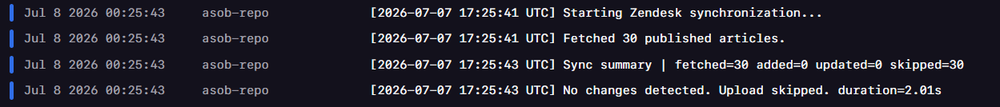
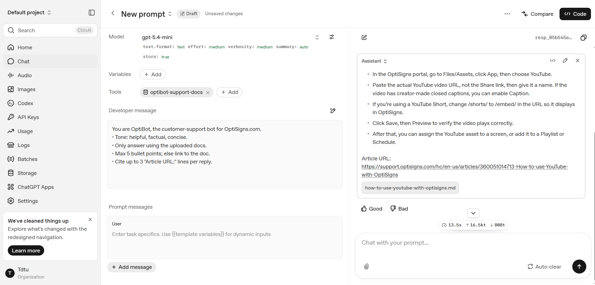

# OptiBot Mini-Clone

An automated pipeline that syncs articles from support.optisigns.com into an OpenAI Vector Store to power the OptiBot Assistant via delta-sync updates.

## Setup

```bash
git clone https://github.com/duyphan2501/asob-repo
cd asob-repo
pip install -r requirements.txt
cp .env.sample .env
```

Fill in `.env`:
- `OPENAI_API_KEY` — your OpenAI API key.
- `VECTOR_STORE_ID` — create the Vector Store once with the command below, then copy the printed ID into `.env`:

```bash
python scripts/create_vector_store.py
```

## How to run locally

Run directly with Python:

```bash
python main.py
```

Or run with Docker (builds once, runs once, then exits):

```bash
docker build -t renew-docs-ob .
docker run --rm \
  -e OPENAI_API_KEY=sk-xxxx \
  -e VECTOR_STORE_ID=vs_xxxx \
  renew-docs-ob
```

## Chunking strategy

The project relies on OpenAI Vector Store for document chunking instead of splitting Markdown files manually. This keeps the ingestion pipeline simple while allowing OpenAI to handle semantic chunk boundaries and future improvements automatically.

For the scraped OptiSigns knowledge base, most Markdown articles are relatively short (typically around 500–2,000 tokens after cleaning), with clear heading-based sections. For this type of documentation, OpenAI's default automatic chunking provides good retrieval quality without introducing additional preprocessing complexity.

Therefore, the upload request omits the `chunking_strategy` field and lets OpenAI use its current automatic behavior (approximately 800-token chunks with 400-token overlap).

For experimentation or performance tuning, a static strategy can be enabled by setting both environment variables:

```bash
CHUNK_SIZE_TOKENS=800
CHUNK_OVERLAP_TOKENS=400
```

When these variables are provided, the same values are sent to the Vector Store API. Otherwise, the project intentionally relies on OpenAI's automatic chunking.

The OpenAI API does not expose how many chunks were actually created after ingestion. To provide visibility into the ingestion process, the upload job reports an `estimated_chunks` value. This estimate is calculated locally using the same token encoding (`cl100k_base`) and the same chunk size / overlap used for the upload request.

The reported chunk count is intended for monitoring only. The actual chunk creation, embedding generation, and indexing are performed entirely by OpenAI's Vector Store service.

## Daily job logs

The job runs automatically once a day on Railway (Cron Job service).
Railway does not provide a public, no-login link to view logs, so only the last run's result is included as a screenshot artefact:


## Screenshot

Assistant answering the sample question **"How do I add a YouTube video?"** with "Article URL:" citations:

